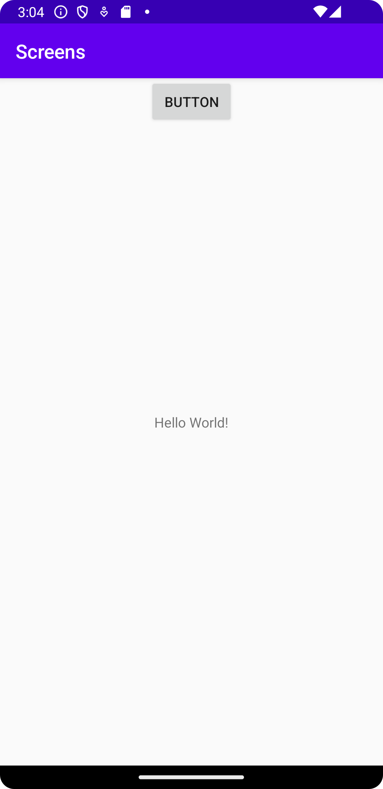

Först forkades det länkade githubprojektet. Efter det lades det
till ännu en aktivitet vid namn "MainActivity2" samt en till layoutfil 
vid namn "activity_main2". I den första aktiviteten skapades sedan en
knapp. Denna knapp skrevs såhär i activity_main:

<Button
android:id="@+id/button"
android:layout_width="wrap_content"
android:layout_height="wrap_content"
android:text="Button"
app:layout_constraintLeft_toLeftOf="parent"
app:layout_constraintRight_toRightOf="parent"
tools:layout_editor_absoluteX="161dp"
tools:layout_editor_absoluteY="573dp"
tools:ignore="MissingConstraints" />

Samt såhär i MainActivity:

Button bytSidaKnapp = findViewById(R.id.button);

Sedan behövde denna knapp öppna den andra aktiviteten om man klickar på
knappen. Detta gjordes genom att göra en intent i "onClick" i
"MainActivity" såhär:

Intent intent = new Intent(MainActivity.this, MainActivity2.class);
intent.putExtra("name", "nextPage");
startActivity(intent);

Efter detta skapades en bundle där datan "name" lades till genom att
skriva:

Bundle extras = getIntent().getExtras();
name = extras.getString("name");

Till sist skapades en widget i activity_main2 där data från intent
visas. TextViewn skevs såhär:

android:id="@+id/myTextView"
android:layout_width="wrap_content"
android:layout_height="wrap_content"
android:text="Hello World!"/>

Efter det skevs i MainActivity2 koden nedanför för att visa själva datan
bundle som skapades:

name = "intent".concat(name);
Log.d("==>", name);
Log.d("==>", "" + myTextView);
myTextView.setText(name);

Som säkert är synligt är det en del "log.d" i koden då det blev en massa
problem på vägen och däför behövdes det debugas.

